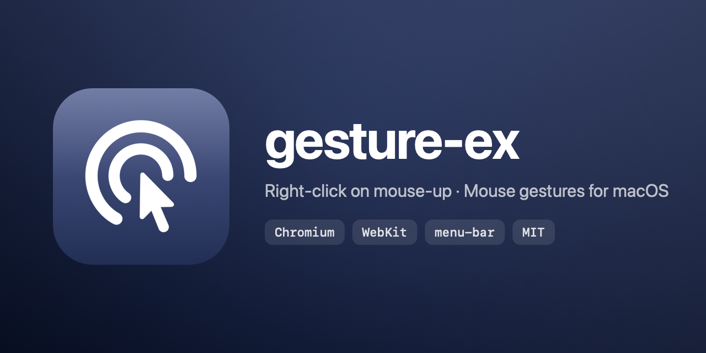

# gesture-ex

> macOS menu-bar utility that brings **Windows-style right-click on mouse-up** behavior and **mouse gestures** to Chromium- and WebKit-based browsers.




## Why

On Windows / Linux, right-click triggers the context menu when the button is **released** — so you can press → drag → preview → release. macOS triggers on press, which forces you to commit before seeing the context and breaks gesture extensions (CrxMouse, Smartup, Gesturefy). `gesture-ex` shifts the trigger to mouse-up at the HID layer and adds native mouse gestures that don't rely on any browser extension.

## Features

- **Right-click on mouse-up** — context menu fires on release, so you can drag-preview-cancel.
- **4-direction mouse gestures** — Back / Forward / Scroll-to-Top / Scroll-to-Bottom out of the box, fully remappable across 13 actions.
- **User-drawn custom gestures** — multi-segment patterns like `←↑`, `↓→`, recognized by direction-change detection. Each pattern fires a built-in action, a user-recorded **keyboard shortcut** (e.g. `⇧⌘A`, `⌥F5`), or a **mouse action** (scroll up/down/left/right by N lines, middle-click). Add, **edit**, and remove entries from the Settings list.
- **Live trail overlay** — smooth blue trail with a label showing the action that will fire on release.
- **Per-engine toggles** — enable independently for Chromium and WebKit families.
- **Adaptive fallback** — short clicks, non-browser apps, and ambiguous drags pass through to the normal context menu (or silently cancel).

| Default | Action            | Shortcut |
|---------|-------------------|----------|
| ←       | Back              | ⌘ [      |
| →       | Forward           | ⌘ ]      |
| ↑       | Scroll to Top     | Home     |
| ↓       | Scroll to Bottom  | End      |

## Quick start

```bash
brew install --cask --no-quarantine registas-hub/tap/gesture-ex

# If you forgot --no-quarantine (or already had the cask installed),
# strip the quarantine flag manually so Gatekeeper stops blocking the launch:
xattr -dr com.apple.quarantine /Applications/gesture-ex.app
```

`--no-quarantine` and the `xattr` recovery line are both required because the app is self-signed (not Apple Developer ID) and not notarized — without them, macOS shows *“cannot be opened…”* on first launch. Either flag prevents that. The GUI alternative (System Settings → **Open Anyway**) works too — see [Installation](docs/installation.md) for the full walkthrough and a manual zip download.

After install, grant **Accessibility** + **Input Monitoring** in *System Settings → Privacy & Security*, then toggle the menu-bar item ON. Global hotkey **⌥⌘G** toggles anywhere.

## Documentation

| Document | Contents |
|----------|----------|
| [Installation](docs/installation.md) | Homebrew, pre-built release, build from source, permissions, Gatekeeper bypass |
| [Usage](docs/usage.md) | Menu-bar layout, gesture examples, Settings (mappings · overlay · custom gestures · app scope) |
| [Architecture](docs/architecture.md) | Layered diagram, event flow, tested browsers, permissions rationale, design decisions |
| [Development](docs/development.md) | Project layout, iteration, adding actions/browsers, regenerating icon, releasing |

## License

[MIT](./LICENSE) © Registas — repo at [registas-hub/gesture-ex](https://github.com/registas-hub/gesture-ex)
